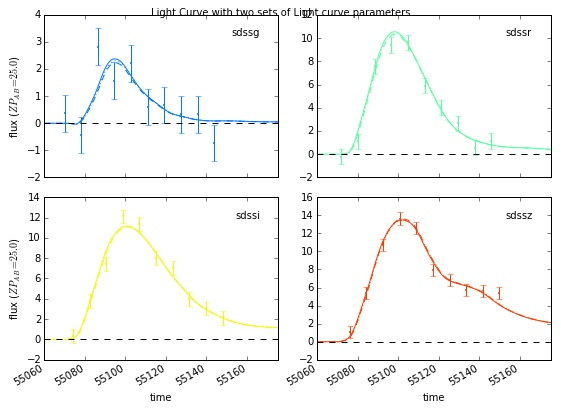
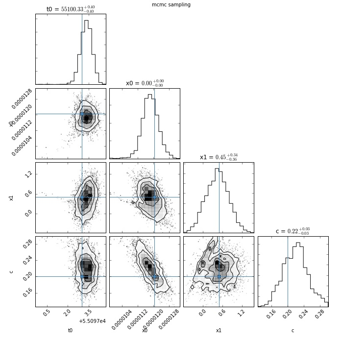
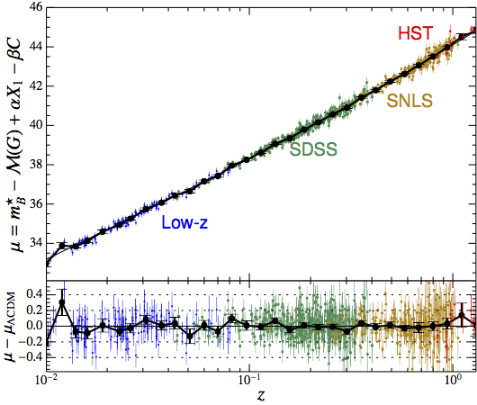
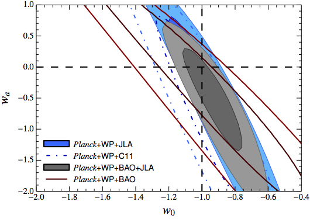

## Short Summary

This project is designed to study supernova Type Ia (SNIA) light curves and
estimate characteristics leading to understanding their peak
intrinsic brightnesses.  The following figure (to see more details go to the
[fitting tutorial](https://github.com/rbiswas4/photozSN/blob/master/docs/Fitting_Template.ipynb))
shows an example light curve describing the brightness of
the supernova as seen from the earth (y axis) as a
function of time (x axis, in [Modified Julian Date](https://en.wikipedia.org/wiki/Julian_day))
in different filter bands as explained in the project pitch.

Within the scope that we will be working in a Type Ia SN is described by a
 handful of parameters (x0, x1, c, t0). If you know these parameters, you can find out the values of the fluxes for that supernova in the light curve plot. What we 
need to do is the inverse of that problem: Knowing what data we had (described
 by the little dots) and what the uncertainties on those data points were
 (described by the error bars), we want to infer the  values of the light curve parameters. This is what the next figure describes.  We  use statistical
 methods to infer the values of a set of light curve 
characterestics  that are useful for our work with  uncertainties as shown in the following figure. 

How do we understand the above figure?  It tells us that using our methods, we 
learned that the SNIa could have had different sets of parameters that could give such a light curve, if the measurement uncertainties are represented by the
error bars. The histograms along the diagonal represent the probability of each
parameter, while the contour plots describe the joint probability of pairs of
parameters. 

The methods of doing these have been devised a couple of
decades ago, and have been improved over time. We will use different tools to do this, but most of them will be based on implementations in 
[SNCosmo](http://sncosmo.github.io). You can check out the documentation of that package in [SNCosmo_docs](http://sncosmo.readthedocs.org/en/v1.1.x/ ) while the  [Fitting tutorial](https://github.com/rbiswas4/photozSN/blob/master/docs/Fitting_Template.ipynb) will give you more background about how, why or when to use these tools. More specifically, the goal of this project will be to understand how well one can estimate the 'redshift' of SNIa  from such light curves. The next
section will explain what these quantities are and why they are scientifically
important. Finally, we will discuss how the datasets in currently ongoing and
up-coming surveys will be different, therefore requiring us to modify our tools,
and how this project takes a step towards those modifications.

## Background of the Research Area

Scientifically, these light curve characteristics x1, c, and
x0 (which is often interchanged with a parameter
called mB* are then used to understand the impact of expansion history of
the universe, often described as a 'Hubble Diagram' which combined with other
survey information allows us to draw inferences about the physics driving the
recent accelerated expansion of the universe. As an example, consider the
results of the [Joint Lightcurve Analysis (JLA)](http://supernovae.in2p3.fr/sdss_snls_jla/ReadMe.html)
project which combined data from the Sloan Digital Sky Survey
and the SuperNova Legacy Survey (SNLS) to obtain the following Hubble Diagram
(looks a little different from what you might find on the web as the y-axis is
logarithmic), which are used to derive constraints on parameters w0, wa
often used to  describe dark energy as shown in the next plot. Note the 'Hubble
diagram' is a function of the light curve parameters mB, X1,
C which are the parameters that were determined in analysing light
curves in the plots above.

## More general background of Research Goals

We want to do this for the most modern datasets from the current and 
upcoming astronomical surveys like [PANSTARRS](http://pan-starrs.ifa.hawaii.edu/public/),
[Dark Energy Survey (DES)](http://www.darkenergysurvey.org/) and the upcoming
[Large Synoptic Sky Survey (LSST)](http://www.lsst.org/). A common characteristic
of all of these surveys is that the data will be
a. of large size with good photometry (light curves)
b. but will not have spectra for a large fraction of light curves, simply
because it will not be feasible to spectroscopically follow up that many
light curves within the few week period during which a supernova is visible. This is in contranst to the supernovae that were used in constructing the Hubble Diagram above. All of those Supernovae had light curves, but they also had at least one well-measured spectrum. 

Traditionally, light curves have been used to estimate the intrinsic brightness
of supernovae Type Ia, whereas spectra have been used
a. to obtain 'redshift' z of the supernovae (The x axis in the Hubble Diagram above),
which tells you how much expansion  of the universe has happened since the supernova exploded (Look at the
[Supernova notebook](https://github.com/rbiswas4/photozSN/blob/master/docs/Supernova_Ia.ipynb)
to get a better sense of how spectra have been used to obtain redshifts
and how only some of this information is available in light curves.
Thus doing this from light curves is harder, but not impossible.)
b. Classify the type of SN and confirm that they are Type Ia.

In the absence of spectra, we will be using light curves to also do these two tasks.
In particular, during this project, we will work on trying to understand how well
we can determine redshift from these light curves. The goals of this project
would be to use our existing tools 
More generally, the problem of inferring redshifts from only the photometry of
astrophysical objects is well known beyond supernovae, and is studied in great detail for galaxies.
This process of recovering photometric redshifts (as it is often called) in
galaxies is often plagued by the problem of "catastrophic failures", where a
number of outliers are found to be very different from inferred values compared
to inferred uncertainties. Once SNIa have been identified (This requires the
 classifcation as well), one might expect the problem to be easier, but the actual performance has to be studied. Also, note that supenovae are formed in galaxies, and therefore it may be possible to use information about the galaxy and 
supernova simultaneously.

## Goals of this Project

The basic goals of this project will be to use some of the tools that
we have (see the [fitting tutorial](https://github.com/rbiswas4/photozSN/blob/master/docs/Fitting_Template.ipynb)
for details) on a simulated dataset for LSST which we will provide and use the tools for light curve analysis to
- Build statistics of how well these tools and some new modifications do in
inferring both the redshift and light curve characteristics from the light curves.
- Try to understand the cause of 'failures' if significant. For the cases
we will study, these may be related to
     - the kind of prior used on redshift and other parameters simultaneously
     - Multiple solutions (we have a new update in our methods to explore this)
     - Finiteness of model spectrum.

Characterizing the cause could open up the ways to improve this method in
tackling the failures.

Feel free to discuss this more either by emailing us at the ids lisaleemcb, or
rbiswas4 at gmail.com or by using the issues feature of this repository or the
chat feature.
